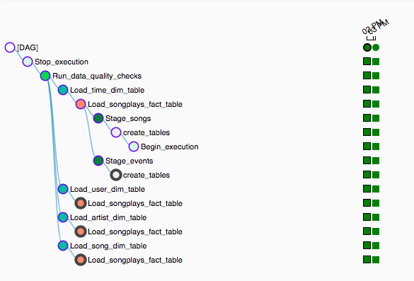
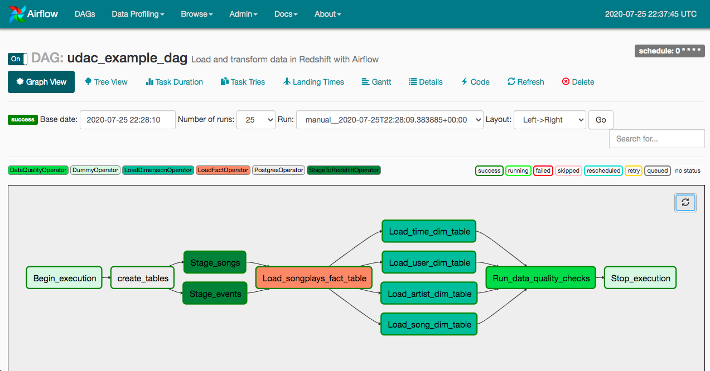

# Data Pipeline with Airflow

## Introduction

A music streaming company, Sparkify, has decided that it is time to introduce more automation and monitoring to their data warehouse ETL pipelines and come to the conclusion that the best tool to achieve this is Apache Airflow.

The task is to build high grade data pipelines that are dynamic and built from reusable tasks, can be monitored, and allow easy backfills.

The source data resides in S3 and needs to be processed in Sparkify's data warehouse in Amazon Redshift. The source datasets consist of JSON logs that tell about user activity in the application and JSON metadata about the songs the users listen to.


## Project Datasets

**Song data: 's3://udacity-dend/song_data'

**Log data: 's3://udacity-dend/log_data'


Song Dataset
The first dataset is a subset of real data from the Million Song Dataset(https://labrosa.ee.columbia.edu/millionsong/). Each file is in JSON format and contains metadata about a song and the artist of that song. The files are partitioned by the first three letters of each song's track ID. For example: *song_data/A/A/B/TRAABJL12903CDCF1A.json*

```{"num_songs": 1, "artist_id": "ARJIE2Y1187B994AB7", "artist_latitude": null, "artist_longitude": null, "artist_location": "", "artist_name": "Line Renaud", "song_id": "SOUPIRU12A6D4FA1E1", "title": "Der Kleine Dompfaff", "duration": 152.92036, "year": 0}```

Log Dataset
The second dataset consists of log files in JSON format. The log files in the dataset with are partitioned by year and month. For example: *log_data/2018/11/2018-11-12-events.json log_data/2018/11/2018-11-13-events.json*

```{"artist":"Pavement", "auth":"Logged In", "firstName":"Sylvie", "gender", "F", "itemInSession":0, "lastName":"Cruz", "length":99.16036, "level":"free", "location":"Klamath Falls, OR", "method":"PUT", "page":"NextSong", "registration":"1.541078e+12", "sessionId":345, "song":"Mercy:The Laundromat", "status":200, "ts":1541990258796, "userAgent":"Mozilla/5.0(Macintosh; Intel Mac OS X 10_9_4...)", "userId":10}```


## Project Structure
* The **dag template** has all the imports and task templates in place, but the task dependencies have not been set
* The **operators** folder with operator templates
* A **helper class** for the SQL transformations  


## Project Steps
### 1. Create user and launch a redshift cluster on AWS


### 2. Add Airflow Connections
#### Configure AWS credentials
* Conn Id: Enter aws_credentials.    
* Conn Type: Enter Amazon Web Services.  
* Login: Enter your Access key ID from the IAM User credentials you downloaded earlier.  
* Password: Enter your Secret access key from the IAM User credentials you downloaded earlier.  


#### Create Redsift connection
* Conn Id: Enter redshift.  
* Conn Type: Enter Postgres.  
* Host: Enter the endpoint of your Redshift cluster, excluding the port at the end. You can find this by selecting your cluster in the Clusters page of the Amazon Redshift console. See where this is located in the screenshot below. IMPORTANT: Make sure to NOT include the port at the end of the Redshift endpoint string.  
* Schema: Enter dev. This is the Redshift database you want to connect to.  
* Login: Enter awsuser.  
* Password: Enter the password you created when launching your Redshift cluster.
* Port: Enter 5439.  


### 3. Configure the DAG
Configure the task dependencies so that after the dependencies are set, the graph view follows the flow shown in the image below.



        
Briefly talking about the ELT process:  
* Stage the raw data from s3 to redshift  
* Transform the raw data to the songplays fact table  
* Trandform the raw data to the dimension tables  
* Check the data quality for fact and fimension tables  

### 4. Build the operators
Build four different operators that will stage the data, transform the data, and run checks on data quality.

**Stage Operator**  
The stage operator is expected to be able to load any JSON formatted files from S3 to Amazon Redshift. The operator creates and runs a SQL COPY statement based on the parameters provided. The operator's parameters should specify where in S3 the file is loaded and what is the target table.

The parameters should be used to distinguish between JSON file. Another important requirement of the stage operator is containing a templated field that allows it to load timestamped files from S3 based on the execution time and run backfills.

**Fact and Dimension Operators**   
With dimension and fact operators, you can utilize the provided SQL helper class to run data transformations. Most of the logic is within the SQL transformations and the operator is expected to take as input a SQL statement and target database on which to run the query against. You can also define a target table that will contain the results of the transformation.

Dimension loads are often done with the truncate-insert pattern where the target table is emptied before the load. Thus, you could also have a parameter that allows switching between insert modes when loading dimensions. Fact tables are usually so massive that they should only allow append type functionality.

**Data Quality Operator**  
The final operator to create is the data quality operator, which is used to run checks on the data itself. The operator's main functionality is to receive one or more SQL based test cases along with the expected results and execute the tests. For each the test, the test result and expected result needs to be checked and if there is no match, the operator should raise an exception and the task should retry and fail eventually.

### Steps
Initialize Airflow `/mnt/airflow/start.sh`
Kick off the DAG in Airfow UI

